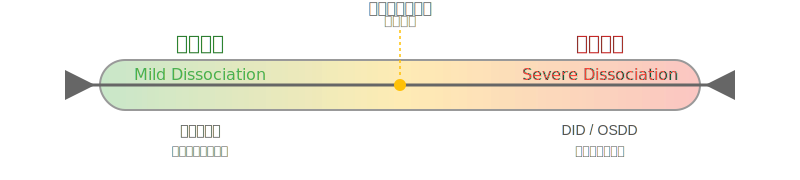

# 技术约定

本文档定义文件结构、链接管理、图片资源组织等技术规范。

---

## 1. 文件结构

### 1.1 目录组织

```text
plurality_wiki/
├── docs/                    # MkDocs 构建源目录
│   ├── entries/            # 词条文件（不得有子目录）
│   ├── assets/             # 静态资源
│   │   ├── figures/       # 图表、流程图、SVG
│   │   ├── images/        # 一般图片、封面
│   │   └── icons/         # 小图标、装饰素材
│   ├── dev/               # 开发文档
│   └── contributing/      # 贡献指南（本目录）
├── entries/                # 词条备份（工具兼容）
├── tools/                  # 工具脚本
└── mkdocs.yml             # MkDocs 配置
```

### 1.2 词条存放规则

!!! warning "重要"

    - **所有词条** ：必须存放在 `docs/entries/` 目录
    - **禁止子目录** ：不得在 `docs/entries/` 下创建子目录

---

## 2. Frontmatter 规范

### 2.1 必需字段

每篇词条必须以 YAML Frontmatter 开头：

```yaml
---
title: 词条标题
tags:

  - 标签1
  - 标签2
  - 标签3

updated: 2025-10-07
---
```

### 2.2 字段说明

| 字段 | 类型 | 必需 | 说明 |
|------|------|------|------|
| `title` | 字符串 | ✅ | 词条标题，应与文件名一致 |
| `tags` | 数组 | ✅ | 相关标签，用于分类索引 |
| `updated` | 日期 | ✅ | 最后更新日期（YYYY-MM-DD），**由 CI 自动维护** |

!!! info "updated 字段的自动维护"

    `updated` 字段会由 GitHub Actions CI 自动维护：

    - 推送词条修改后，CI 会自动运行 `tools/update_git_timestamps.py` 脚本
    - 脚本会根据 Git 提交历史自动更新 `updated` 字段
    - 自动过滤 CI 机器人的提交，仅反映实质性内容修改
    - **贡献者无需手动更新此字段**，专注于内容编写即可

    详见：[`.github/workflows/update-timestamps.yml`](https://github.com/mps-team-cn/Multiple_personality_system_wiki/blob/main/.github/workflows/update-timestamps.yml)

### 2.3 标签选择

参考现有词条，选择合适的标签：

- **诊断** ：`解离障碍`、`创伤`、`共病`
- **概念** ：`多意识体`、`系统运作`、`身份`
- **实践** ：`Tulpa`、`冥想`、`接地`
- **文化** ：`影视`、`文学`、`媒体表现`

---

## 3. 链接管理

### 3.1 内部链接格式

**从词条文件引用其他词条** ：

```markdown
[解离性身份障碍](DID.md)
[多意识体](Multiple_Personality_System.md)
[创伤](Trauma.md)
```

**说明** ：

- 使用相对路径（同目录下直接用文件名）
- MkDocs 会自动处理 `.md` 扩展名
- **禁止** 使用绝对路径（如 `/docs/entries/DID.md`）

### 3.2 跨目录链接

**从词条引用其他目录文件** ：

```markdown
[贡献指南](../contributing/index.md)
[开发文档](../dev/THEME_GUIDE.md)
```

**从其他目录引用词条** ：

```markdown
[解离性身份障碍](../entries/DID.md)
[多意识体系统](../entries/Multiple_Personality_System.md)
```

### 3.3 锚点链接

**引用同页面章节** ：

```markdown
[参见：诊断标准](#诊断标准)
```

**引用其他页面章节** ：

```markdown
[参见：DID 的诊断标准](DID.md#诊断标准)
```

---

## 4. 图片资源组织

### 4.1 资源目录结构

```text
docs/assets/
├── figures/        # 图表、流程图、示意图、SVG
├── images/         # 一般图片（封面、截图等）
└── icons/          # 小图标、装饰性素材
```

### 4.2 引用路径规范

**从词条文件（`docs/entries/xxx.md`）引用图片** ：

✅ **正确** ：

```markdown


```

❌ **错误** ：

```markdown
  # 绝对路径可能失效
```

### 4.3 图片文件命名

- 使用 **小写字母** + **连字符**
- 描述性命名，避免使用 `img1.png` 等无意义名称
- 示例：
    - `dissociation-spectrum.svg`
    - `did-diagnosis-flowchart.png`
    - `trauma-types-comparison.jpg`

### 4.4 图片引用示例

```markdown


**来源**：改编自 Van der Hart, O., et al. (2006). *The Haunted Self*, p. 45
**许可**：CC BY-SA 4.0
```

### 4.5 图片版权要求

- **必须注明来源与许可**
- 原创图表标注"原创"
- 改编图表标注"改编自..."
- 确保符合版权法与项目协议（CC BY-SA 4.0）

---

## 5. 最后更新时间管理

MkDocs Material 使用 `git-revision-date-localized` 插件自动从 Git 历史获取每个页面的最后修改时间和创建时间，无需手动维护时间戳。

插件配置位于 `mkdocs.yml` 中：

```yaml

- git-revision-date-localized:

    enabled: !ENV [CI, false]
    enable_creation_date: true
    type: timeago
    timezone: Asia/Shanghai
    locale: zh
    fallback_to_build_date: true
```

页面底部会自动显示：

- **创建时间**：文件首次被 Git 跟踪的时间
- **最后更新时间**：文件最后一次被修改的时间（使用 timeago 格式，如"2 天前"）

---

## 6. 目录与索引同步

### 6.1 需要同步的文件

更新或新增词条时，必须同步修改：

1. **`docs/tags.md`** - 标签索引（由 MkDocs tags 插件自动生成）
2. **`docs/index.md`** - 首页导航
3. **`docs/Glossary.md`** - 术语表（如适用）

### 6.2 标签索引

MkDocs Material 的 `tags` 插件会自动生成标签索引。

**无需手动维护** ，只需确保 Frontmatter 中标签正确。

### 6.3 首页导航

新增重要词条时，考虑添加到首页导航：

```markdown

### :material-hospital-box: [诊断与临床](entries/Clinical-Diagnosis-Guide.md)

- [解离性身份障碍（DID）](entries/DID.md)
- [其他特定解离性障碍（OSDD）](entries/OSDD.md)
- [新增词条](entries/New-Entry.md)  # 新增

```

---

## 7. Python 环境配置

### 7.1 系统要求

- Python 3.8 或更高版本
- pip 或虚拟环境支持

### 7.2 环境配置方式

#### 方式一：使用虚拟环境（推荐）

适用于 Debian/Ubuntu 等外部管理 Python 环境的系统：

```bash

# 1. 安装 venv 支持（如需要）

sudo apt install python3.12-venv  # 或对应的 Python 版本

# 2. 创建虚拟环境

python3 -m venv venv

# 3. 激活虚拟环境

source venv/bin/activate

# 4. 安装依赖

pip install -r requirements.txt
```

**后续使用**：每次使用项目工具前，需先激活虚拟环境：

```bash
source venv/bin/activate
```

#### 方式二：系统级安装

适用于非托管 Python 环境：

```bash

# 直接安装依赖

pip install -r requirements.txt

# 或使用 pip3

pip3 install -r requirements.txt
```

#### 方式三：使用 pipx（应用程序）

适用于仅运行工具，不需要开发环境：

```bash

# 安装 pipx

sudo apt install pipx

# 使用 pipx 运行工具

pipx run mkdocs serve
```

### 7.3 常见问题

#### `pip: command not found`

**解决方案**：

```bash

# 方法 1：使用 python3 -m pip

python3 -m pip install -r requirements.txt

# 方法 2：安装 pip

python3 -m ensurepip --default-pip

# 方法 3：系统包管理器安装

sudo apt install python3-pip
```

#### `externally-managed-environment` 错误

这是 Debian/Ubuntu 系统的安全特性，推荐使用虚拟环境（见 7.2 方式一）。

**不推荐**：使用 `--break-system-packages` 标志可能破坏系统 Python 环境。

### 7.4 依赖管理

项目依赖定义在 `requirements.txt`：

```text
mkdocs>=1.6.1
mkdocs-material>=9.5.44
mkdocs-git-revision-date-localized-plugin>=1.2.9
```

更新依赖：

```bash
pip install --upgrade -r requirements.txt
```

---

## 8. 构建与部署

### 8.1 本地构建

```bash

# 开发模式（热重载）

mkdocs serve

# 生产构建

mkdocs build

# 严格模式（检测所有警告）

mkdocs build --strict
```

### 8.2 Cloudflare Pages 部署

项目使用 Cloudflare Pages 自动部署：

- **触发** ：推送到 `main` 分支
- **构建命令** ：见 `.cfpages-build.sh`
- **输出目录** ：`site/`

### 8.3 构建配置

详见：

- `mkdocs.yml` - MkDocs 配置
- `.cfpages-build.sh` - Cloudflare Pages 构建脚本
- `requirements.txt` - Python 依赖

---

## 9. 工具脚本

### 9.1 常用工具

| 工具 | 功能 | 命令 |
|------|------|------|
| `fix_markdown.py` | Markdown 格式修复 | `python tools/fix_markdown.py` |
| `gen-validation-report.py` | 生成校验报告 | `python tools/gen-validation-report.py` |

### 9.2 工具文档

详细使用说明请参考 [工具文档](../dev/Tools-Index.md)。

---

## 10. 开发者文档

### 10.1 技术文档位置

```text
docs/dev/
├── FRONTEND_ARCHITECTURE.md    # 前端架构
├── MIGRATION_REPORT.md         # 迁移报告
├── INDEX_GUIDE.md              # 索引指南
└── ...
```

### 10.2 开发文档规范

- 技术细节放在 `docs/dev/` 目录
- 不包含在主导航中
- 面向贡献者和开发者

---

## 11. 检查清单

提交前请确认：

- [ ] 词条存放在 `docs/entries/` 目录
- [ ] Frontmatter 包含 `title`、`tags`、`updated` 字段
- [ ] 内部链接使用相对路径
- [ ] 图片引用路径正确（`../assets/...`）
- [ ] 图片注明来源与许可
- [ ] 最后更新时间已更新
- [ ] 同步更新相关索引（如需要）
- [ ] 本地构建成功（`mkdocs build --strict`）

---

## 相关文档

- [编写规范](writing-guidelines.md)
- [学术引用](academic-citation.md)
- [诊断临床规范](clinical-guidelines.md)
- [PR 流程](pr-workflow.md)
