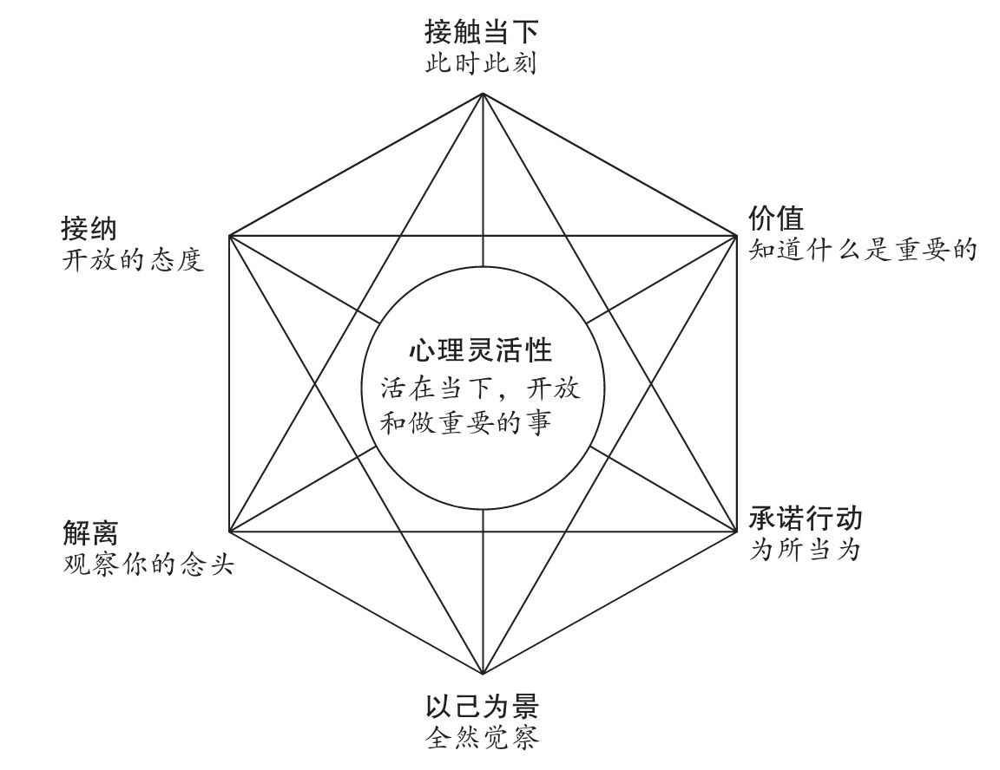

# 接受与承诺疗法（Acceptance and Commitment Therapy, ACT）

!!! warning "医疗免责声明"
    本词条内容仅供教育与参考，不能替代专业医疗建议、诊断或治疗。心理治疗应在持证心理治疗师或精神科医师的指导下进行。

## 概述

**接受与承诺疗法（Acceptance and Commitment Therapy, ACT）** 是第三波认知行为疗法的代表性方法，由 Steven Hayes 在 1980 年代开发。与传统 [CBT](Cognitive-Behavioral-Therapy-CBT.md) 强调改变思维内容不同，ACT 强调 **改变与思维和情绪的关系**，培养 **[心理弹性](Psychological-Resilience.md)（Psychological Flexibility）**。

ACT 的核心理念是：**痛苦是人类经验的正常部分**，试图消除或控制痛苦往往导致更多痛苦。ACT 帮助人们：

- **接纳（Accept）**：开放地体验困难的想法与情绪
- **选择方向（Choose direction）**：澄清个人价值观
- **采取行动（Take action）**：做出与价值观一致的承诺行动

---

## 理论基础

### 关系框架理论（Relational Frame Theory, RFT）

ACT 基于关系框架理论，认为人类语言与认知能力既是祝福也是诅咒：

- **语言的力量**：让我们能够计划、学习、创造
- **语言的陷阱**：让我们能够焦虑未来、反刍过去、自我批判

**认知融合（Cognitive Fusion）**：与想法纠缠，把想法当作现实

- "我是失败者" → 我 = 失败者
- "没人喜欢我" → 这是事实

**经验性回避（Experiential Avoidance）**：试图消除或控制内在体验

- 回避焦虑 → 错过机会
- 压抑悲伤 → 情绪爆发
- 逃避记忆 → 解离

**ACT 的目标**：打破这两个陷阱，培养心理弹性。

---

## 六大核心过程

ACT 通过 **六大核心过程** 培养心理弹性，常用 **ACT 六边形模型** 呈现：

### 1. 接纳（Acceptance）

- **定义**：主动、开放地体验内在经验（想法、情绪、感觉、记忆）
- **不是**：喜欢痛苦、放弃改变、无奈忍受
- **是**：为了价值观而愿意体验痛苦

**练习**：

- 焦虑时：注意身体感觉，允许焦虑存在
- 悲伤时：给悲伤空间，不试图推开

**对比经验性回避**：

- 回避：压抑、分心、麻痹、解离
- 接纳：观察、允许、容纳

---

### 2. 认知解融（Cognitive Defusion）

- **定义**：与想法保持距离，看到"想法只是想法"
- **技巧**：

**命名技术**：

- "我在想……" 而非 "……是真的"
- "我的头脑告诉我……"

**观察想法**：

- 想象想法像云飘过
- 想象想法写在纸上

**语言游戏**：

- 重复一个词 30 次，直到失去意义
- 用好笑的声音说负面想法

**效果**：

- "我是失败者" → "我在想'我是失败者'"
- 想法的情绪冲击力下降，行为自由度增加

---

### 3. 活在当下（Present Moment Contact）

- **定义**：灵活地、自愿地关注当下
- **与正念的关系**：ACT 整合了 [正念](Mindfulness.md) 练习

**技巧**：

- **五感接地**：注意 5 个看到的、4 个听到的、3 个触摸到的…… ([接地技巧](Grounding.md))
- **正念呼吸**：注意呼吸的进出
- **身体扫描**：注意身体各部分的感觉

**为什么重要**：

- 焦虑活在未来
- 抑郁活在过去
- 当下是行动发生的地方

---

### 4. 观察性自我（Self-as-Context）

- **定义**：注意到"正在观察的我"
- **概念**：

**三个自我层次**：

1. **概念性自我（Self-as-Content）**：
    - "我是内向的""我是焦虑的人"
    - 自我概念、身份标签

2. **观察性自我（Self-as-Context）**：
    - "正在注意的我"
    - 想法、情绪、角色来来去去，但观察者保持稳定

3. **过程性自我（Self-as-Process）**：
    - 持续展开的自我叙述

**练习**：

- 注意："我在体验焦虑"，谁在注意？
- 棋盘隐喻：想法与情绪是棋子，你是棋盘

**对多意识体系统的意义**：

- 不同[成员](Alter.md)来来去去（棋子）
- [系统](System.md)整体是观察者（棋盘）
- 帮助减少身份混乱

---

### 5. 价值观（Values）

- **定义**：你选择的人生方向，想成为什么样的人
- **特征**：
    - 永远不会"完成"（不是目标）
    - 内在动机（不是外在规则）
    - 持续的行为模式

**价值观领域**：

- 关系（家庭、伴侣、友谊）
- 工作/教育
- 休闲/兴趣
- 健康/身体
- 灵性/成长
- 社群/公民

**价值观 vs 目标**：

- 价值观："成为关怀的朋友"（方向）
- 目标："本周联系 3 个朋友"（里程碑）

**练习**：

- **丧礼练习**：你希望别人如何记得你？
- **80 岁的你**：回顾人生时，什么最重要？
- **价值观卡片分类**：从卡片中选出最重要的价值

---

### 6. 承诺行动（Committed Action）

- **定义**：基于价值观采取有效行动
- **不是**：
    - 完美主义
    - 一次性决定
    - 不顾情绪硬撑

- **是**：
    - 小步骤
    - 持续行动
    - 允许挫折

**SMART 目标设定**：

- **S**pecific：具体
- **M**easurable：可衡量
- **A**chievable：可达成
- **R**elevant：与价值观相关
- **T**ime-bound：有时间限制

**行为改变技巧**：

- **行为激活**：安排与价值观一致的活动
- **暴露练习**：逐步接近恐惧情境
- **技能训练**：学习需要的技能

**障碍处理**：

- 识别障碍（内在：恐惧；外在：资源）
- 使用其他五个过程：接纳恐惧、解融负面想法、活在当下、连接价值观

---

## ACT 六边形模型

<figcaption style="text-align: center; font-style: italic; color: gray; margin-top: 8px;">
ACT 六边形模型（ACT Hexaflex）：六个核心过程围绕心理灵活性展开
</figcaption>

**两大核心主题**：

1. **心理灵活性过程**（左侧）：
    - 接纳 + 认知解融 = **开放**

2. **行为投入过程**（右侧）：
    - 价值观 + 承诺行动 = **投入**

3. **正念过程**（中间）：
    - 活在当下 + 观察性自我 = **觉察**

---

## 治疗结构

### 个别治疗

- **频率**：通常每周 1 次，每次 50 分钟
- **时长**：8-20 次，灵活调整
- **流程**：
    1. **评估**：识别经验性回避、认知融合、价值观模糊
    2. **创造性绝望**：探索"你试过的所有控制痛苦的方法有效吗？"
    3. **六大过程训练**：逐步引入接纳、解融、正念、自我、价值、行动
    4. **隐喻与体验练习**：ACT 大量使用隐喻、想象、正念练习
    5. **巩固与维持**：应用到生活

### 团体治疗

- **频率**：每周 1 次，2 小时
- **时长**：8-12 周
- **优势**：
    - 共同体验练习
    - 互相支持
    - 价值观分享

---

## 适用人群

### ✅ 推荐用于

- **焦虑与恐惧**：[广泛性焦虑](Generalized-Anxiety-Disorder-GAD.md)、[社交焦虑](Social-Anxiety-Disorder.md)、[惊恐障碍](Panic-Disorder.md)
- **抑郁与心境障碍**：[重度抑郁](Major-Depressive-Disorder-MDD.md)、复发性抑郁
- **创伤相关障碍**：[PTSD](PTSD.md)、[CPTSD](CPTSD.md)
- **慢性疼痛**：与疼痛共处，而非消除疼痛
- **物质使用障碍**：减少回避性应对
- **饮食障碍**：接纳身体意象困扰
- **多意识体系统**：[DID](DID.md)/[OSDD](OSDD.md) 的身份接纳与内部合作

### ⚠️ 需谨慎评估

- **急性自杀风险**：需先稳定，[DBT](Dialectical-Behavior-Therapy-DBT.md) 可能更合适
- **严重精神病性症状**：需先控制症状
- **严重认知障碍**：难以理解隐喻

---

## 治疗效果

### 研究证据

- **中到大效应量**：多项 RCT 显示 ACT 对[焦虑](Anxiety-Disorders.md)、[抑郁](Major-Depressive-Disorder-MDD.md)、[慢性疼痛](Chronic-Pain.md)有效
- **慢性疼痛**：ACT 显著改善功能，即使疼痛水平未改变
- **职场压力**：ACT 降低职业倦怠
- **长期效果**：随访研究显示效果维持

### 独特优势

- **超诊断**：适用于多种诊断，因为针对共同的心理过程
- **文化适应性**：隐喻与价值观可适应不同文化
- **自我实践**：可通过自助书、App 学习

---

## ACT 对多意识体系统的应用

### 为什么 ACT 适合 DID/OSDD？

1. **接纳多重性**：不试图"治愈"或"[融合](Fusion.md)"，接纳[系统](System.md)存在
2. **减少内部冲突**：通过解融减少[成员](Alter.md)间的评判
3. **共同价值观**：帮助[系统](System.md)找到共同的人生方向
4. **灵活切换**：培养对[切换](Switch.md)的接纳，而非抗拒

### 改良建议

#### 1. 系统层面的接纳

- **接纳多重性**：
    - "我们是[多意识体系统](Multiple_Personality_System.md)" → 这是我们的现实
    - 不与多重性斗争

- **接纳[成员](Alter.md)差异**：
    - 不同[成员](Alter.md)有不同情绪、记忆、偏好
    - 接纳内部多样性

#### 2. 内部认知解融

- **观察内部想法**：
    - "某[成员](Alter.md)在想……"
    - "这是 A 的想法，不是 B 的想法"

- **减少评判**：
    - "某[成员](Alter.md)是坏的" → "我在评判某成员"
    - 解融促进内部和解

#### 3. 内部正念

- **注意内部状态**：
    - 谁在[前台](Front-Fronting.md)？
    - 谁在[后台](Back-Being-Back.md)？
    - 内部氛围如何？

- **内部五感**：
    - 在内心空间中使用五感[接地](Grounding.md)

#### 4. 系统观察性自我

- **系统整体作为观察者**：
    - 不同成员来来去去([切换](Switch.md))
    - [系统](System.md)作为整体保持连续性

- **棋盘隐喻**：
    - [成员](Alter.md)是棋子，[系统](System.md)是棋盘
    - 减少"谁是真正的我"的困扰

#### 5. 共同价值观

- **内部会议**：
    - 讨论："我们作为[系统](System.md)，想成为什么样的人？"
    - 找到所有[成员](Alter.md)都认同的价值

- **价值观协商**：
    - 不同[成员](Alter.md)可能有不同价值
    - 寻找交集与[整合](Integration.md)

#### 6. 系统承诺行动

- **协调行动**：
    - 基于共同价值采取行动
    - 不同[成员](Alter.md)可以负责不同任务

- **接纳切换**：
    - [切换](Switch.md)发生时，下一个[成员](Alter.md)继续行动
    - 使用共享日志维持连续性

---

## ACT 与其他治疗的关系

### ACT vs CBT

| 特征 | [CBT](Cognitive-Behavioral-Therapy-CBT.md) | ACT |
| --- | --- | --- |
| 目标 | 改变想法内容 | 改变与想法的关系 |
| 对待情绪 | 挑战不合理信念 | 接纳情绪 |
| 焦点 | 症状减少 | 价值导向生活 |
| 技术 | 认知重建 | 认知解融 |

### ACT vs DBT

| 特征 | [DBT](Dialectical-Behavior-Therapy-DBT.md) | ACT |
| --- | --- | --- |
| 理论 | 辩证法、生物-社会 | 关系框架理论 |
| 焦点 | [情绪调节](Emotion-Regulation.md)、技能 | [心理弹性](Psychological-Resilience.md)、价值 |
| 适用 | [BPD](Borderline-Personality-Disorder-BPD.md)、自杀自伤 | 广泛适用 |
| 结构 | 高度结构化 | 灵活 |

### ACT + EMDR

- **阶段 1（稳定）**：ACT 培养接纳与解融
- **阶段 2（创伤加工）**：[EMDR](Eye-Movement-Desensitization-Reprocessing-EMDR.md) 处理创伤记忆
- **阶段 3（整合）**：ACT 价值观与行动

---

## 常用隐喻与练习

### 隐喻

#### 1. 棋盘隐喻（观察性自我）

- 想法与情绪是棋子（黑 vs 白）
- 你是棋盘，容纳所有棋子
- 棋子争斗，但棋盘不受伤害

#### 2. 公交车隐喻（认知解融）

- 你开着公交车（人生）
- 乘客（想法、情绪）上车，大喊大叫
- 你可以继续开车，不必听乘客指挥

#### 3. 流沙隐喻（经验性回避）

- 挣扎 → 下沉更快
- 放松、平躺 → 浮起来
- 接纳痛苦 → 减少痛苦

#### 4. 拔河隐喻（接纳）

- 你 vs 怪物焦虑、抑郁）拔河
- 中间是深渊
- 解决办法：放下绳子

### 练习

#### 1. 叶子溪流练习（认知解融）

- 想象溪流
- 想法写在叶子上
- 看着叶子飘走

#### 2. 扩展练习（接纳）

- 注意不舒服的感觉
- 呼吸，给感觉空间
- "扩展"容纳感觉

#### 3. 价值观指南针

- 画出价值观的方向
- 每天检查：我朝哪个方向走了？

---

## 自我练习资源

### 书籍

- 《接受承诺疗法：简明实操手册》— Russ Harris
- 《幸福陷阱》— Russ Harris（科普版）
- 《Get Out of Your Mind and Into Your Life》— Steven Hayes

### App

- ACT Companion
- The Happiness Trap App

### 在线资源

- ACT Mindfully（Russ Harris 网站）
- Association for Contextual Behavioral Science (ACBS)

---

## 相关条目

- [认知行为疗法（CBT）](Cognitive-Behavioral-Therapy-CBT.md)
- [辩证行为疗法（DBT）](Dialectical-Behavior-Therapy-DBT.md)
- [正念（Mindfulness）](Mindfulness.md)
- [接地技巧（Grounding）](Grounding.md)
- [解离性身份障碍（DID）](DID.md)
- [复杂性创伤后应激障碍（CPTSD）](CPTSD.md)
- [情绪调节（Emotion Regulation）](Emotion-Regulation.md)
- [内在家庭系统疗法（IFS）](Internal-Family-Systems-IFS.md)

---

## 参考文献

1. Hayes, S. C., Strosahl, K. D., & Wilson, K. G. (2011). *Acceptance and Commitment Therapy: The Process and Practice of Mindful Change* (2nd ed.). Guilford Press.
2. Harris, R. (2009). *ACT Made Simple: An Easy-To-Read Primer on Acceptance and Commitment Therapy*. New Harbinger Publications.
3. A-Tjak, J. G., et al. (2015). A meta-analysis of the efficacy of acceptance and commitment therapy for clinically relevant mental and physical health problems. *Psychotherapy and Psychosomatics*, 84(1), 30-36.
4. Hayes, S. C., et al. (2006). Acceptance and Commitment Therapy: Model, processes and outcomes. *Behaviour Research and Therapy*, 44(1), 1-25.
