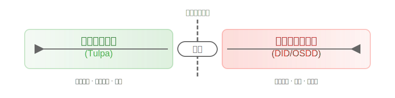

# 核心概念导览（Core Concepts Guide）

> **导读** ：这是一份为初接触多意识体领域的读者准备的入门导览。我们将以通俗的语言帮助你理解核心概念之间的关系，建立起理解整个知识体系的框架。

!!! note "Clinician’s Summary（临床速览）"
    面向专业读者的速览摘要：本文将“解离（Dissociation）[临床术语]”与“多意识体系统（Multiple Personality System, MPS）[跨域]”区分描述，规范使用“解离性身份障碍（Dissociative Identity Disorder, DID）”“其他特定解离性障碍（Other Specified Dissociative Disorder, OSDD）”“人格解体-现实解体障碍（DPDR）”等术语；对“图帕（Tulpa）[社群术语]”等非医学概念采取谨慎表述，强调通常可控、无失忆与功能良好，但如出现痛苦或功能受损应立即停止并进行评估。文中比较表按成因/失忆/可控性/痛苦与功能四要素帮助快速边界判定。

> 理解路径（文本版流程图，可替换为 SVG）：体验 → 术语辨析 → 风险评估 → 支持与转介

---

## 一、从“解离”说起

要理解多意识体现象，我们首先需要认识 **解离（Dissociation）** 这个基础概念。本节概述其含义与程度谱系，帮助区分日常现象与可能的临床问题。

### 什么是解离?

法国心理学家皮埃尔·让内曾指出，解离涉及“构成人格的思想体系和功能系统”之间的分离。

**用简单的比喻理解**：可将解离理解为“功能分层/分区”——某些心理功能暂时与整体协调分离。这种分离有程度之分：

- 可以切 **意识**
- 可以切 **功能**
- 可以切 **记忆**

### 解离的程度谱系

解离不是非黑即白的现象，而是存在一个 **连续的程度谱系**：

注：图示为概念示意，非诊断流程。

- **温和解离**：走神、白日梦、“高速公路催眠”（开车时自动驾驶的状态）——这些是健康且常见的体验
- **中度解离**：在压力下感到世界不真实、情绪麻木、短暂的记忆模糊
- **强烈解离**：持续的失忆、不可控的身份/状态切换、严重的去人格化-现实解体感（DPDR）

**关键理解**：低程度的温和解离是正常现象，不构成疾病；只有当解离反应强烈、持续且招致痛苦或功能受损时，才可能进入病理范畴。

详细了解请参阅：[解离（Dissociation）](Dissociation.md)、[防御性解离](Defensive-Dissociation.md)、[解离障碍](Dissociative-Disorders.md)、[人格解体-现实解体障碍（DPDR）](Depersonalization-Derealization-Disorder-DPDR.md)

---

## 二、解离与多意识体的关系

本节解释“解离”与“多意识体系统（Multiple Personality System, MPS）[跨域]”的联系，指出并非所有解离都指向病理性多意识体。

### 多意识体是什么?

**多意识体系统([MPS](Multiple_Personality_System.md))[跨域]** 指一个个体内部存在两个或以上相对独立、可持续运作的意识单元。这些意识单元（成员）能够在不同程度上共享记忆、情绪与身体控制权。

### 解离如何产生多意识体?

**核心原理**：多意识体是意识分离的现象，而意识分离属于解离现象的一种类型。

用“分层/分区”的隐喻来理解：

- 初始时，整体意识较为一体化
- 经由压力/创伤/学习等因素，相关功能在时间上或内容上“分层/分区”
- 不同“分区”承载不同的记忆、情绪与反应模式
- 在一定条件下，这些“分区”表现为相对独立的身份或角色

### 产生多意识体的表现

当意识功能出现分层/分区后，人们可能会体验到：

- **新的自我认同** :例如身体是男性,但某个部分认为自己是女性
- **陌生感** :肢体脱离控制自行活动
- **隔阂感** :感受到不属于自己的思维被"塞"入大脑
- **失忆** :对某段时间或某些事件完全没有记忆

详细了解请参阅：[多意识体系统（Multiple Personality System，MPS）](Multiple_Personality_System.md)、[系统（System）](System.md)

---

## 三、健康与病理：不同程度的多意识体

本节概述健康实践与临床障碍的关键差异，提供快速对照以便进行边界判定与安全决策。

根据意识分离的程度,多意识体可以分为:

### 🟢 健康多意识体：Tulpa

**图帕([Tulpa](Tulpa.md))[社群术语]** 通常被描述为轻微、温和的意识分离：

- **形成方式**：通过刻意的想象训练、对话练习等主动创造
- **特征**：

    - 通常记忆连贯，无解离性失忆
    - 转换/前台更迭通常可通过练习提升可控性
    - 宿主与 tulpa 的控制权一般以协作为主，报告显示个体差异存在
    - 意识活动强度与权限多为温和、循序提升

- **比喻**：更接近“在同一系统中做轻度分区/分层”

**关键**：社群资料提示，tulpa 实践以“在健康界限内的温和分层”为目标；若出现痛苦或功能受损，建议立即停止实践并寻求评估。

!!! warning "安全提示：出现下列任一情况请立即暂停并评估"

    - 持续或加重的痛苦、恐惧、强烈触发反应
    - 不可控的切换或长时段记忆断片（疑似失忆）
    - 学业/工作/人际功能显著受损
    - 自伤/自杀意念或行为
    - 睡眠严重紊乱、现实定向力显著下降

    建议：先行暂停练习，进行[接地（Grounding）](Grounding.md)与自我安全管理，并寻求专业评估。

!!! tip "边界与伦理：自助实践 ≠ 医疗行为"

    - Tulpa 等社群实践不等同于医疗诊疗；涉及评估与诊断应由持证专业人员完成。
    - 涉及共前台/附体练习时，应确保知情同意、撤回权与外部安全。

### 🔴 病理性多意识体：DID/OSDD

**解离性身份障碍（Dissociative Identity Disorder, [DID](DID.md)）** 与 **其他特定解离性障碍（Other Specified Dissociative Disorder, [OSDD](OSDD.md)）[临床术语]** 通常属于强烈且病理性的意识分离：

- **形成原因**：多与早期反复性创伤相关，被理解为在极端压力下的适应性保护机制
- **特征**：

    - 不可控的身份/状态切换
    - 解离性失忆（可能丢失大段时间）
    - 明显的痛苦与功能受损
    - 成员数量可能较多，权限分配复杂

- **比喻**：更接近“分区明显、跨分区通道受限”

**关键理解** :

1. DID/OSDD 的解离多为 **被动的、创伤相关的** ——像失灵的报警器，即使没有危险也会响
2. OSDD 可理解为 DID 光谱中的较轻表现，但仍可伴发痛苦/功能受损
3. 媒体俗称“多重人格”，非标准临床称谓；临床使用 DID/OSDD 等规范名称

相关临床术语：

- [人格解体-现实解体障碍（DPDR）](Depersonalization-Derealization-Disorder-DPDR.md)
- [附体型（Possession）相关体验](Possession.md)（区分 ICD-11 6B63 附体型障碍）

详细了解请参阅：[DID](DID.md)、[OSDD](OSDD.md)、[创伤（Trauma）](Trauma.md)

### 界限在哪里?

注：图示为概念示意，非诊断流程。

- **界限特征**：成因（是否与创伤相关）、是否存在失忆、可控性水平、是否招致痛苦与功能受损
- **重要提醒**：社群实践通常不表现为创伤性失忆与严重功能受损；如出现痛苦或功能受损，应立即停止实践并寻求专业评估。

（对照表）健康实践与临床障碍的关键差异：

| 维度 | Tulpa（社群术语） | DID/OSDD（临床术语） |
|------|-------------------|-----------------------|
| 成因 | 多为自愿练习/塑造 | 多与早期反复性创伤相关 |
| 失忆 | 通常无解离性失忆 | 常见解离性失忆（时段缺失） |
| 可控性 | 通常较高，可随训练提升 | 通常较低，切换多为被动 |
| 痛苦与功能 | 以适应/陪伴为目的，多不显著受损 | 痛苦显著且伴功能受损 |

---

## 四、埃蒙加德分类法：从成因理解系统

**埃蒙加德分类法([Emmengard Classification](Emmengard-Classification.md))[社群术语]** 是社群内常用的分类框架，按意识体的 **来源** 进行分类：

### 📊 分类图解

注：图示为概念示意，非诊断流程。

### 各类型说明

#### 1. 创造型(Created)

- **典型代表** :Tulpa 系统
- **形成方式** :通过对话、想象、角色扮演等刻意练习创造
- **特点** :出于爱与陪伴,而非娱乐化精神疾病

#### 2. 创伤型(Adaptive/Traumagenic)

- **典型代表** :DID、OSDD 系统
- **形成方式** :由创伤刺激导致
- **特点** :失忆、不可控转换、痛苦体验

#### 3. 自发型(Spontaneous)

- **形成方式** :自然产生,非创伤也非刻意创造
- **注意** :容易误判,需排除隐藏的创伤或失忆

#### 4. 未知型(Unknown)

- **用途** :"兜底分类",成因不明时使用
- **建议** :不确定时可默认为混合型

#### 5. 混合型(Mixed)

- **特点** :多种成因共存
- **建议** :当无法确定单一类型时,建议默认为混合型

### 🚨 重要提醒

1. 该分类法 **不是医学标准**，仅是社群内的自我理解工具
2. 无需过度执着严格分类——“在一滩浑水里，别指望能看清界限”
3. 搞不清就选混合型，不必焦虑

详细了解请参阅：[埃蒙加德分类法](Emmengard-Classification.md)

---

## 五、常见误区澄清

本节用简短案例澄清常见误解，帮助避免不必要的紧张与标签执念。

### ❌ 误区 1:"不是 DID 就一定是 Tulpa"

**真相**：不要忽略 OSDD 和混合型的存在。如果你：

- 没有长期的对话创造行为
- 系统成员数量很多
- 有创伤或解离症状

那么很可能 **不是** 单纯的 tulpa，建议了解 OSDD 或混合型。

### ❌ 误区 2:"多意识体是个'围城'"

有人认为：DID 患者想减少解离，tulpa 实践者想增加分层，似乎矛盾。

**真相**：

- DID 患者希望减少的是 **病理性、造成受损** 的解离
- Tulpa 实践追求的是 **健康界限内的、温和的** 分层/分区
- 二者的目标与程度不同，不构成“围城”

### ❌ 误区 3:"必须找到权威定义才能理解自己"

**真相**：

- 多意识体领域的学术研究仍有限
- 诸多概念为社群自创，未必获得学界共识
- **关注主观感受与生活质量往往更为重要**

---

## 六、如果你想深入了解

### 🔍 核心概念词条

- [解离（Dissociation）](Dissociation.md) - 一切的基础
- [多意识体系统（Multiple Personality System，MPS）](Multiple_Personality_System.md) - 总体概念
- [系统（System）](System.md) - 系统的定义与运作

### 🏥 临床诊断相关

- [DID](DID.md) - 解离性身份障碍（Dissociative Identity Disorder）
- [OSDD](OSDD.md) - 其他特定解离性障碍（Other Specified Dissociative Disorder）
- [PTSD](PTSD.md) / [CPTSD](CPTSD.md) - 创伤后应激障碍/复杂性创伤后应激障碍
- [DPDR](Depersonalization-Derealization-Disorder-DPDR.md) - 人格解体-现实解体障碍

### 🌱 健康多意识体

- [Tulpa](Tulpa.md) - 创造型意识体
- [埃蒙加德分类法](Emmengard-Classification.md) - 系统分类

### ⚙️ 系统运作机制

- [前台（Fronting）](Front-Fronting.md) - 控制身体
- [切换（Switch）](Switch.md) - 成员转换
- [融合（Fusion）](Fusion.md) - 成员整合
- [内部空间（Inner World）](Headspace-Inner-World.md) - 意识内部的想象空间

### 🛡️ 实践与照护

- [接地（Grounding）](Grounding.md) - 稳定技巧
- [冥想（Meditation）](Meditation.md) - 呼吸调节、身体扫描与内在平静中心建立
- [内部沟通](Internal-Communication.md) - 成员协作

---

## 七、给新手的建议

### ✅ 推荐做的

1. **先理解，再分类**：理解自身体验比寻找“正确标签”更重要
2. **关注感受，而非术语**：呈现失忆/失控等主观感受比堆砌术语更有效
3. **优先处理创伤**：若存在创伤相关问题，治疗优先于理论探索
4. **保持开放**：理解可能随时间调整，这是常见现象

### ⚠️ 避免做的

1. **避免执着于确诊**：确诊并不必然带来更好的照护路径
2. **避免过度求证**：定义与分类本就多源且不完全一致
3. **留意 OSDD**：不少人更符合 OSDD 光谱
4. **期待管理**：不同专业人士对该领域了解程度差异较大

### 🆘 何时寻求专业帮助

如果你遇到：

- 严重失忆影响生活
- 不可控的转换
- 自伤或自杀倾向
- 创伤相关的痛苦

请寻求心理治疗师（而非普通咨询师）的帮助，条件允许时优先挂专科门诊/专家号。

---

## 八、关于本导览

### 📚 参考来源

本导览综合了：

- 社群内流传的知识文章
- 临床医学文献中的解离与 DID/OSDD/DPDR 等研究
- 多意识体系统的自述经验

### ⚖️ 免责说明

- 本导览 **不构成医疗建议**
- 埃蒙加德分类法等社群概念 **不是医学标准**
- 如需诊断或治疗，请咨询持证专业人员

### 🤝 持续更新

我们欢迎你：

- 指出错误或过时信息
- 分享你的体验与建议
- 通过 [贡献指南](../contributing/index.md) 参与完善

---

## 延伸阅读

### 📖 参考书籍

- 《解离与创伤》
- 《萦绕不安的自我:人格结构解离和长期心理创伤治疗》
- 《你经历了什么:关于创伤、疗愈和复原力的对话》

### 🔗 相关词条

- [系统角色（System Roles）](System-Roles.md)
- [成员（Alter）](Alter.md)
- [宿主（Host）](Host.md)

---

## 术语索引（本文出现的常见术语，按拼音）

- [Alter（成员）](Alter.md)
- [CPTSD（复杂性创伤后应激障碍）](CPTSD.md)
- [DID（解离性身份障碍）](DID.md)
- [DPDR（人格解体-现实解体障碍）](Depersonalization-Derealization-Disorder-DPDR.md)
- [Dissociation（解离）](Dissociation.md)
- [Fusion（融合）](Fusion.md)
- [Front/Fronting（前台/出面）](Front-Fronting.md)
- [Grounding（接地）](Grounding.md)
- [Host（宿主）](Host.md)
- [Internal Communication（内部沟通）](Internal-Communication.md)
- [OSDD（其他特定解离性障碍）](OSDD.md)
- [PTSD（创伤后应激障碍）](PTSD.md)
- [Switch（切换）](Switch.md)
- [System（系统）](System.md)
- [Tulpa（图帕）](Tulpa.md)

---

> **最后的话** ：理解这些概念需要时间,不必急于一时。重要的是找到适合你自己的理解方式,并在这个过程中照顾好自己。无论你的系统是什么类型,你的体验都是真实且值得被尊重的。
