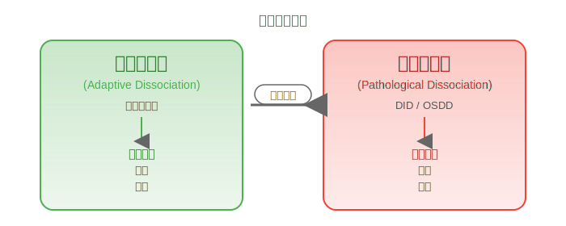
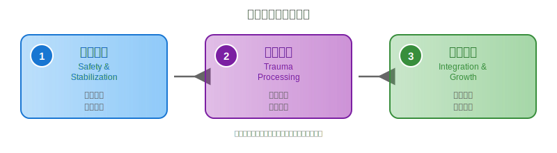

# 心理健康导览(Mental Health Guide)

> **这是一份地图,而非百科全书**。本导览帮助你快速了解多意识体领域中的核心心理健康议题,并指引你找到更深入的资源。

---

## 如何使用本导览

**适合人群**:

- 🆕 刚接触创伤、解离、多意识体概念的新手
- 🤔 怀疑自己或身边人可能需要专业帮助
- 🧭 想要建立心理健康知识框架
- 🔗 寻找进一步学习资源

**不适合**:

- ❌ 自我诊断(请寻求专业评估)
- ❌ 替代医疗建议(本文仅供参考)
- ❌ 深入学术研究(请查阅专门条目)

**阅读建议**: 全文约 10-15 分钟,可按需跳转到相关章节。每个概念都链接到详细条目。

---

!!! danger "危机求助"
    如果你正在经历自杀想法、严重自伤或无法保证安全:

    - **立即拨打**: 120(医疗急救)、110(警察)
    - **心理热线**:
        - 北京心理危机干预中心: 010-82951332
        - 上海心理热线: 021-12320-5
        - 希望24热线: 400-161-9995

---

## 第一部分:核心概念速览

### 创伤:一切的起点

[**创伤（Trauma）**](Trauma.md) 是个体遭遇严重威胁事件后产生的强烈痛苦反应。它不是"软弱",而是 **真实的神经生物学改变**。

**关键区分**:

| I 型创伤 | II 型创伤 |
|---------|----------|
| 单次事件 | 长期、反复 |
| 如:车祸、灾害 | 如:童年虐待、长期暴力 |
| 可能自行缓解 | 易发展为复杂障碍 |

**创伤如何影响你**:

- 警报系统失灵(即使安全也感到威胁)
- 记忆处理困难(失忆或闪回)
- 情绪调节受损
- 长期压力激素异常

💡 **核心理解**: 创伤是生理性伤害,需要时间和专业支持修复。

---

### 解离:从保护到障碍

[**解离（Dissociation）**](Dissociation.md) 是创伤反应的核心机制,就像用锯子"切脑子"——被切出的部分与你断开连接。

**功能谱系**:

**常见解离障碍**:

- [**人格解体/现实解体（DPDR）**](Depersonalization-Derealization-Disorder-DPDR.md): 感觉自己或世界不真实
- [**解离性遗忘（DA）**](Dissociative-Amnesia-DA.md): 无法回忆重要信息
- [**解离性身份障碍（DID）**](DID.md): 存在多个身份状态
- [**其他特定解离障碍（OSDD）**](OSDD.md): 接近 DID 但不完全符合

📖 详见: [解离障碍](Dissociative-Disorders.md)

---

### 创伤相关障碍地图

#### PTSD:创伤后应激障碍

[**PTSD**](PTSD.md) 的四大核心症状:

1. **侵入性体验** - 闪回、噩梦、不自主回忆
2. **持续回避** - 避免创伤相关的人、事、地点
3. **负性认知/情绪改变** - "我没用""世界很危险"、情感麻木
4. **警觉性改变** - 过度警觉、易惊、失眠

⏰ **诊断要求**: 症状持续 >1 个月,显著影响功能

---

#### CPTSD:复杂性创伤后应激障碍

[**CPTSD**](CPTSD.md) = PTSD 全部症状 + **自我组织障碍(DSO)**:

1. **情绪调节困难** - 持续情绪波动或麻木
2. **负性自我概念** - 长期羞耻、"我被损坏了"
3. **人际困扰** - 难以建立或维持关系

**关键区别**:

| | PTSD | CPTSD |
|---|------|-------|
| 创伤类型 | 单次或短期 | 长期、无法逃离 |
| 核心问题 | 创伤记忆重现 | 创伤记忆 + 人格结构损害 |
| 典型诱因 | 灾害、事故 | 童年虐待、战俘、人口贩运 |

⚠️ **注意**: 中国大陆目前不承认 ICD-11 的 CPTSD 诊断,病历上可能写为 PTSD 或其他诊断。

---

### 情绪障碍:常见共病

创伤幸存者高频共病:

- [**抑郁障碍**](Depressive-Disorders.md) (60-80%) - 持续悲伤、兴趣丧失、无望感
- [**焦虑障碍**](Anxiety-Disorders.md) (50-70%) - 过度担忧、警觉、躯体紧张
- [**物质使用障碍（SUD）**](Substance-Use-Disorders-SUD.md) (30-50%) - 通过物质"自我用药"
- [**边缘性人格障碍（BPD）**](Borderline-Personality-Disorder-BPD.md) (30-40%) - 情绪不稳定、人际困难

📊 **共病不是"病得更重"** - 它们往往源于同一套受损的神经系统,需要综合治疗。

---

## 第二部分:何时需要帮助

### 症状自查清单

如果以下情况 **持续超过一个月** 且影响日常生活,建议寻求专业评估:

**创伤相关**:

- [ ] 反复闪回或噩梦
- [ ] 避免与创伤相关的任何事物
- [ ] 无法回忆创伤的重要部分
- [ ] 持续感到威胁,即使在安全环境

**解离相关**:

- [ ] 大段时间失忆(不记得自己做过什么)
- [ ] 感觉自己或世界不真实
- [ ] 发现自己处于陌生地点,不知如何到达
- [ ] 内部听到其他声音或存在感

**情绪相关**:

- [ ] 持续抑郁超过两周
- [ ] 无法从任何活动中获得快乐
- [ ] 过度担忧影响正常生活
- [ ] 失眠或睡眠过多

---

### 🚨 危险信号:立即求助

以下情况需 **立即寻求急诊或住院评估**:

- ⛔ 有具体的自杀计划或手段
- ⛔ 严重自伤且无法停止
- ⛔ 精神病性症状(幻觉、妄想)导致危险行为
- ⛔ 无法照顾基本生活需求(进食、卫生)
- ⛔ 严重解离发作导致自伤或他伤风险

**不要等待"足够严重"** - 及早干预效果更好。

---

## 第三部分:寻求帮助指南

### 治疗选项概览

#### 心理治疗(首选)

**基础认知行为疗法**:

- [**认知行为疗法（CBT）**](Cognitive-Behavioral-Therapy-CBT.md) - 改变功能失调的思维模式，训练适应性行为
- [**接受与承诺疗法（ACT）**](Acceptance-Commitment-Therapy-ACT.md) - 培养心理弹性，接纳困难情绪，基于价值观行动

**创伤聚焦治疗**:

- [**眼动脱敏与再加工（EMDR）**](Eye-Movement-Desensitization-Reprocessing-EMDR.md) - 通过双侧刺激处理创伤记忆
- [**延长暴露疗法（PE）**](Prolonged-Exposure-Therapy-PE.md) - 反复接触创伤记忆，减少回避与恐惧
- [**认知加工疗法（CPT）**](Cognitive-Processing-Therapy-CPT.md) - 改变"都是我的错"等负性信念
- [**创伤聚焦认知行为疗法（TF-CBT）**](Trauma-Focused-Cognitive-Behavioral-Therapy-TF-CBT.md) - 专门针对儿童青少年的创伤治疗

**情绪与接地技能**:

- [**辩证行为疗法（DBT）**](Dialectical-Behavior-Therapy-DBT.md) - 情绪调节、人际效能、痛苦耐受
- [**躯体经验疗法（SE）**](Somatic-Experiencing-SE.md) - 通过身体觉察释放创伤能量

**多意识体专门治疗**:

- [**内在家庭系统疗法（IFS）**](Internal-Family-Systems-IFS.md) - 协调内部不同"部分"
- [**阶段导向创伤治疗**](Three-Phase-Trauma-Treatment.md) - 稳定 → 处理 → 整合

#### 创伤治疗三阶段模型

---

#### 药物治疗(辅助)

⚠️ **重要**: 药物由精神科医师评估,以下仅供参考。

**常用类别**:

- 抗抑郁药(SSRIs/SNRIs) - 缓解 PTSD、抑郁、焦虑
- 抗焦虑药(短期) - 急性焦虑、惊恐发作
- 情绪稳定剂 - 情绪波动
- 助眠药 - 失眠、噩梦

**药物能做的**: 缓解症状,提高心理治疗耐受性

**药物不能做的**: 直接治疗创伤记忆,消除解离,替代心理治疗

💊 **对多意识体系统**: 某些药物可能影响切换频率或共意识,需与医生充分沟通。

---

### 如何找到合适的治疗师

#### ✅ 优先选择

- 有创伤知情训练背景
- 了解 PTSD/CPTSD/解离性障碍
- 使用循证方法(EMDR、TF-CBT、DBT 等)
- 尊重你的节奏和边界

#### ❌ 避免

- 不相信 DID/OSDD 存在
- 强迫你"融合"或"消除人格"
- 忽视创伤,只开药
- 缺乏创伤治疗经验

#### 寻找途径

1. **精神专科医院** - 挂专家号,询问创伤门诊或解离障碍门诊
2. **心理治疗机构** - 寻找 EMDR、TF-CBT 认证治疗师
3. **在线资源** - 中国心理学会临床心理学注册系统

---

### 第一次就诊准备

📋 **建议带上**:

- 症状清单(何时开始、频率、严重程度)
- 创伤史(如果愿意分享)
- 目前困扰和期待
- 之前的诊断或治疗经历
- 正在服用的药物

🚫 **不要期待**:

- 第一次就确诊
- 立即开始处理创伤记忆
- 治疗师能"读懂你的心"

---

### 治疗需要多久?

**没有标准答案**,参考时间:

- PTSD(单次创伤): 3-6 个月
- CPTSD(复杂创伤): 1-3 年或更长
- DID/OSDD: 通常需要数年

🌱 **关键**: 康复不是线性的,会有起伏,这是正常的。

---

## 第四部分:自我照护实践

理解心理健康问题是第一步,学会实际应对技巧同样重要。我们为你准备了一套完整的自我照护工具箱。

### 🧰 [自我照护工具箱](Self-Care-Toolkit.md)

这是一份详细的实践指南,包含:

- **接地技巧** - 应对焦虑、闪回、解离的急救方法（5-4-3-2-1感官练习、温度接地等）
- **呼吸与身体调节** - 降低压力、改善睡眠的科学方法（盒式呼吸、渐进式肌肉放松等）
- **情绪调节工具** - DBT的TIPP快速技巧，快速降低情绪强度
- **安全感建立** - 创建内在安全空间、情绪命名练习
- **日常照护要点** - 睡眠、饮食、运动、触发管理
- **多意识体系统专用建议** - 共享工具、负荷分担、边界尊重

**为什么需要独立的工具箱?**

- 💡 所有技巧都是 **安全且经过验证的**，不需要专业人员指导即可开始
- 💡 在平静时先练习，困难时刻能自然使用
- 💡 建立个人化工具箱，找到最适合你的方法

👉 [**点击查看完整工具箱**](Self-Care-Toolkit.md)

---

## 给支持者的建议

如果你想帮助正在经历创伤或心理健康问题的人:

### ✅ 推荐做法

- **倾听,不评判** - "我相信你"比"这不算什么"更有帮助
- **尊重边界** - 不追问细节,不强迫"坚强"
- **提供实际支持** - 陪同就诊,帮助日常事务
- **照顾好自己** - 支持者也需要支持,设定边界避免耗竭

### ❌ 避免做法

- "这是真的吗?""你确定不是想多了?"(否定/质疑)
- "你应该...""你为什么不..."(未经请求的建议)
- "别人更糟都没事"(比较)
- 替对方做决定(就诊、吃药、告诉他人)

---

## 常见问题速答

??? question "我怀疑自己有 PTSD/CPTSD,但不确定,怎么办?"

    记录症状(频率、严重程度、触发因素),然后寻求专业评估。不要自我诊断,也不要因"不够糟"而犹豫。

??? question "治疗师不相信 DID/OSDD,怎么办?"

    考虑更换治疗师。如暂时无法更换,可聚焦症状管理(焦虑、抑郁),同时在社群寻求同伴支持。

??? question "药物会改变我的人格吗?"

    正确使用的精神科药物不会改变人格。需 2-6 周见效,副作用通常几周后减轻。不要自行停药。

??? question "我能'治愈'创伤吗?"

    创伤记忆不会消失,但可以被整合和处理。治疗目标是减少症状、恢复功能、不再被创伤控制。

??? question "我需要告诉别人我的诊断吗?"

    你没有义务告诉任何人。考虑披露前思考:这个人可信吗?告诉他们对我有什么好处?有污名化风险吗?

---

## 延伸阅读索引

### 按主题深入学习

**创伤基础**:

- [创伤（Trauma）](Trauma.md) - 创伤的神经科学与类型
- [PTSD](PTSD.md) - 创伤后应激障碍详细诊断与治疗
- [CPTSD](CPTSD.md) - 复杂性创伤后应激障碍
- [触发（Trigger）](Trigger.md) - 触发机制与管理
- [闪回（Flashback）](Flashback.md) - 闪回的类型与应对

**解离相关**:

- [解离（Dissociation）](Dissociation.md) - 解离的机制与功能
- [解离障碍](Dissociative-Disorders.md) - 解离障碍谱系详解
- [防御性解离](Defensive-Dissociation.md) - 解离作为防御机制
- [人格解体/现实解体障碍（DPDR）](Depersonalization-Derealization-Disorder-DPDR.md) - DPDR 详解
- [解离性遗忘（DA）](Dissociative-Amnesia-DA.md) - 创伤相关的失忆

**情绪与心境**:

- [抑郁障碍](Depressive-Disorders.md) - 抑郁的诊断与治疗
- [焦虑障碍（Anxiety Disorders）](Anxiety-Disorders.md) - 焦虑障碍详解
- [心境障碍](Affective-Disorders.md) - 心境障碍概览
- [物质使用障碍（SUD）](Substance-Use-Disorders-SUD.md) - 物质滥用与依赖
- [边缘性人格障碍（BPD）](Borderline-Personality-Disorder-BPD.md) - BPD 与创伤的关系

**实践工具**:

- [接地（Grounding）](Grounding.md) - 接地技巧详解
- [冥想（Meditation）](Meditation.md) - 呼吸调节、身体扫描与深度放松冥想引导
- [情绪调节](Emotion-Regulation.md) - 情绪调节策略

**多意识体核心**:

- [核心概念导览](Core-Concepts-Guide.md) - 多意识体基础概念
- [解离性身份障碍（DID）](DID.md) - DID 详细说明
- [其他特定解离障碍（OSDD）](OSDD.md) - OSDD 类型与特征

---

### 推荐书籍

1. **《身体从未忘记:心理创伤疗愈中的大脑、心智和身体》** - Bessel van der Kolk(创伤治疗经典)
2. **《你经历了什么:关于创伤、疗愈和复原力的对话》** - Oprah & Dr. Perry(易读入门)
3. **《解离与创伤》** - 创伤治疗专业教材
4. **《萦绕不安的自我》** - 结构性解离理论

---

## 最后的话

心理健康的康复不是线性的。你可能会经历进步、倒退、停滞、突破 —— **这些都是正常的**。

记住:

- 💙 你的痛苦是真实的
- 💙 你值得被支持
- 💙 康复需要时间
- 💙 你不是一个人

**如果你正在阅读这篇导览,说明你已经在寻求理解和改变 —— 这本身就是勇敢的第一步。**

---

> 💙 **致所有正在康复路上的你**: 每一小步都值得被看见,每一次求助都是勇敢。
