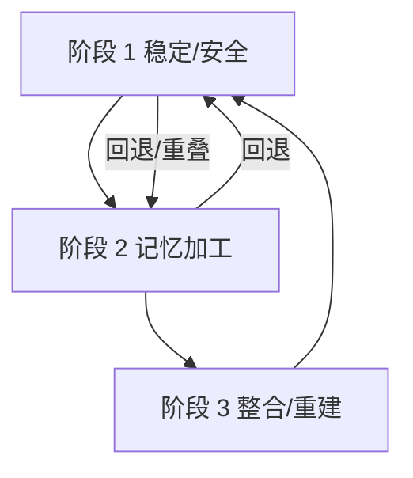

---
tags:

    - 创伤与疗愈

topic: 创伤与疗愈
title: 三阶段创伤治疗模型（Three-Phase Trauma Treatment）
description: 创伤治疗的经典三阶段框架：先稳定安全与功能，再在可耐受窗口内加工创伤记忆，最终实现关系修复、身份重建与整合。适用于复杂创伤与解离相关状况的循序式临床路线。
synonyms:

    - 三阶段治疗
    - 阶段性治疗
    - 阶段导向治疗
    - Phase-Oriented Treatment
    - 三阶段创伤治疗

search:
  boost: 1.5
updated: 2025-10-19
comments: true
---

# 三阶段创伤治疗模型（Three-Phase Trauma Treatment）

!!! warning "医疗免责声明"
    本词条内容仅供教育与参考，不能替代专业医疗建议、诊断或治疗。创伤治疗应在持证心理治疗师或精神科医师的指导下进行。

!!! info "Clinician’s Summary（约 180 字）"
    该模型源自 Herman（1992）并由 Courtois & Ford（2009）等在复杂创伤领域系统扩展。治疗并非线性，而是在“稳定—加工—整合”间以安全为前提的往返推进。阶段 1 聚焦外部/内部安全、治疗联盟与情绪调节，建立足够的“安全窗口”。阶段 2 在可耐受范围内进行记忆加工与认知重构，可采用 EMDR、CPT、PE、TF‑CBT 等，并随时回到阶段 1 进行稳固。阶段 3 致力于关系修复、意义建构与整合，DID/OSDD 系统目标可为协作与整合，而非必然完全融合。

## 定义

三阶段创伤治疗模型（Three-Phase Trauma Treatment）是创伤治疗领域广泛采用的治疗框架，学术来源可追溯至 Judith L. Herman 在《创伤与恢复》（*Trauma and Recovery*, 1992）中的阶段性治疗思想[^herman1992]，此后由 Courtois 与 Ford（2009）基于复杂创伤的实证与临床经验予以系统化与扩展[^courtois2009]。模型强调康复是渐进过程，通常按顺序推进三个关键阶段，并根据个体耐受度在阶段间灵活往返。

## 三个阶段

### 阶段 1：安全与稳定（Safety and Stabilization）

一句话摘要：先稳住，再处理——所有后续工作以安全与调节能力为前提。

**目标** ：建立安全感、稳定情绪与恢复日常功能。

**核心任务** ：

- **建立治疗关系** : 与治疗师建立信任与安全的治疗联盟
- **确保外部安全** : 评估并消除当前的危险因素（如持续的虐待环境）
- **学习调节技巧** :

    - [接地技巧（Grounding）](Grounding.md)
    - 情绪调节策略
    - 应对触发的方法

- **稳定日常生活** :

    - 建立规律的作息
    - 恢复基本自我照护（饮食、睡眠、卫生）
    - 制定危机应对计划

**持续时间** ：因人而异，可能需要数月甚至数年。

**重要提醒** ：在安全与稳定尚未建立前，不应进入创伤加工阶段。过早进行创伤加工可能导致再创伤化（re‑traumatization）。临床上建议在可耐受范围（“安全窗口”，window of tolerance）内推进，以降低失稳风险[^siegel1999]。

---

### 阶段 2：创伤记忆加工（Trauma Processing）

一句话摘要：在“安全窗口”内，逐步加工创伤记忆与相关意义。

**目标** ：在安全的治疗环境中处理创伤记忆，整合解离的情绪与经历。

**核心任务** ：

- **创伤叙事** : 在治疗师指导下，详细讲述创伤经历
- **情绪整合** : 处理创伤相关的情绪（恐惧、愤怒、羞耻、悲伤）
- **认知重构** : 挑战与修正创伤相关的负性信念（如"这是我的错"）
- **解离整合** : 对于[多意识体](Multiple_Personality_System.md)系统，可能涉及不同成员共享创伤记忆

**常用治疗方法** ：

- [**眼动脱敏与再加工（EMDR）**](Eye-Movement-Desensitization-Reprocessing-EMDR.md): 通过双侧刺激帮助大脑重新处理创伤记忆
- [**创伤聚焦认知行为疗法（TF-CBT）**](Trauma-Focused-Cognitive-Behavioral-Therapy-TF-CBT.md): 针对儿童青少年创伤的结构化治疗
- [**延长暴露疗法（PE）**](Prolonged-Exposure-Therapy-PE.md): 逐步面对创伤记忆与触发物
- [**认知加工疗法（CPT）**](Cognitive-Processing-Therapy-CPT.md): 识别和改变创伤相关的负性信念
- [**内在家庭系统疗法（IFS）**](Internal-Family-Systems-IFS.md): 与内部部分建立对话，整合创伤经历

**风险管理** ：

- 创伤加工可能暂时增加痛苦与解离症状
- 治疗师需密切监控治疗耐受度（window of tolerance），必要时暂停并返回阶段 1 稳定[^siegel1999]

!!! info "诊断系统与适用范围（DSM‑5‑TR vs ICD‑11）"

    - DSM‑5‑TR 未单列 CPTSD 诊断，主要讨论 PTSD；“复杂创伤”更多作为临床概念处理。
    - ICD‑11 明确区分 PTSD 与 **CPTSD**（含“自我组织障碍”成分：情绪调节、负性自我概念、人际困难）。
    - 对于呈现显著 DSO 特征的来访者，阶段 2 的暴露/加工比重与节奏需更谨慎，往往先在阶段 1 巩固调节能力与人际支持，再逐步过渡至安全可耐受的记忆加工[^whoicd11][^apa2022]。

---

### 阶段 3：整合与重建（Integration and Reconnection）

一句话摘要：把康复带回生活——关系修复、身份重建与持续成长。

**目标** ：发展新的自我认同，重建人际关系与社会功能。

**核心任务** ：

- **自我认同整合** :

    - 将创伤经历整合为生命故事的一部分
    - 发展"幸存者"而非"受害者"的身份
    - 对于[DID](DID.md)/[OSDD](OSDD.md)系统，可能涉及成员整合或协作

- **人际关系重建** :

    - 建立健康的依恋模式
    - 学习设置边界与沟通需求
    - 修复或建立支持性人际关系

- **社会功能恢复** :

    - 重返工作或学习
    - 发展新的兴趣与目标
    - 参与社群活动

- **意义重建** :

    - 探索创伤经历的意义
    - 可能的[创伤后成长（Post‑Traumatic Growth）](Post-Traumatic-Growth-PTG.md)

**持续时间** ：可能持续数年，是终生的康复过程。

---

## 多意识体系统的特殊考量

### 成员之间的阶段差异

不同成员可能处于不同的康复阶段：

- **持有创伤记忆的成员** : 可能仍在阶段 1，需要建立安全感
- **日常前台成员** : 可能已进入阶段 3，重建社会功能
- **保护者成员** : 可能抵制创伤加工，需要尊重其保护意图

### 内部协作

- **建立沟通渠道** : 确保所有成员能够表达意愿与需求
- **尊重节奏** : 不要强迫任何成员进入他们未准备好的阶段
- **协调治疗计划** : 不同成员可能需要不同的治疗策略

- 详见 [内部沟通（Internal Communication）](Internal-Communication.md)

### 融合（Fusion）与整合（Integration）

- [**融合（Fusion）**](Fusion.md) ：成员（部分）发生融合，身份分离显著减少或不再存在。
- [**整合（Integration）**](Integration.md) ：成员保持区分但具有稳定合作、共享信息与协调前台的能力。

两者皆为合法的康复目标，具体取决于系统意愿与功能需求。阶段性治疗的指南强调，整合已可显著改善生活质量，并非必须追求完全融合[^steele2017]。

---

## 非线性进程

**重要理解** ：三阶段模型并非严格线性进程。康复过程中可能：

- **反复循环** : 在阶段之间来回移动（如新的触发导致回到阶段 1）
- **阶段重叠** : 同时进行多个阶段的工作
- **个体差异** : 每个人在各阶段停留的时间不同

---

## 阶段目标对照表

| 阶段 | 核心目标 | 主要干预 | 关键风险/提示 |
| --- | --- | --- | --- |
| 阶段 1 安全与稳定 | 建立外部/内部安全、情绪调节、功能恢复 | 危机计划、接地/呼吸调节、睡眠与作息、治疗联盟 | 过早进入记忆加工易致失稳；以“安全窗口”为准[^siegel1999] |
| 阶段 2 创伤记忆加工 | 加工记忆、整合情绪与意义 | EMDR、CPT、PE、TF‑CBT、叙事、部份工作/IFS | 痛苦反应波动；随时回到阶段 1 稳固；避免“过度暴露”[^apa2022] |
| 阶段 3 整合与重建 | 关系修复、身份与价值重建 | 人际与依恋修复、边界训练、目标设定与复学复工、PTG | 忽视生活功能重建将影响长期维持；目标需具体可执行 |

---

## 常见误区

!!! warning "避免以下高风险做法"

    - **未稳定即加工** ：在调节能力不足或缺乏安全支持时贸然进行暴露/叙事。
    - **忽视生活功能重建** ：只关注症状减轻而忽略阶段 3 的关系与功能目标。
    - **把“整合”误解为“必须融合”** ：整合与协作是等效有效的目标[^steele2017]。

---

## 相关词条

- [创伤（Trauma）](Trauma.md)
- [PTSD（创伤后应激障碍）](PTSD.md)
- [CPTSD（复杂性 PTSD）](CPTSD.md)
- [接地（Grounding）](Grounding.md)
- [解离（Dissociation）](Dissociation.md)
- [内部沟通（Internal Communication）](Internal-Communication.md)
- [阶段性治疗原则（Phase‑Oriented Treatment Principles）](Phase-Oriented-Treatment-Principles.md)

---

## 参考文献

1. Herman, J. L. (1992). *Trauma and Recovery: The Aftermath of Violence—From Domestic Abuse to Political Terror*. Basic Books.
2. Courtois, C. A., & Ford, J. D. (2009). *Treating Complex Traumatic Stress Disorders: An Evidence‑Based Guide*. Guilford Press.
3. Steele, K., Boon, S., & Van der Hart, O. (2017). *Treating Trauma‑Related Dissociation: A Practical, Integrative Approach*. W. W. Norton & Company.
4. Siegel, D. J. (1999). *The Developing Mind: How Relationships and the Brain Interact to Shape Who We Are*. Guilford Press.（“安全窗口”概念）
5. World Health Organization. (2019). *International Classification of Diseases 11th Revision (ICD‑11)*.（6B41 Complex post traumatic stress disorder）
6. American Psychiatric Association. (2022). *Diagnostic and Statistical Manual of Mental Disorders (5th ed., text rev.; DSM‑5‑TR).*
7. van der Kolk, B. A. (2014). *The Body Keeps the Score: Brain, Mind, and Body in the Healing of Trauma*. Viking.

[^herman1992]: Herman, J. L. (1992). Trauma and Recovery. Basic Books.
[^courtois2009]: Courtois, C. A., & Ford, J. D. (2009). Treating Complex Traumatic Stress Disorders. Guilford Press.
[^siegel1999]: Siegel, D. J. (1999). The Developing Mind. Guilford Press —— 提出“安全窗口（window of tolerance）”。
[^whoicd11]: WHO ICD‑11（2019）：6B41 Complex post‑traumatic stress disorder。
[^apa2022]: DSM‑5‑TR（2022）。
