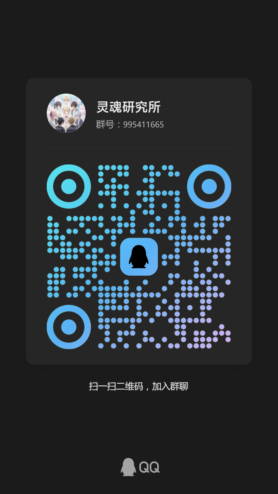

# Multiple Personality System Wiki - 多意识体系统百科

!!! tip 术语说明

    - 为简化表述，本 Wiki 内容中使用的缩写 `MPS`，默认指代 `Multiple Personality System` (`MPS`)。
    - 请注意，社群中更常使用的中立性术语为 `Plural System`。同时，考虑到理论描述的精确性，`MPS` 亦可被理解为 `Multiple Consciousness System` (`MCS`)——一个专注于描述意识多元性本身的理论性术语。
    - 读者可根据自身语境选择最合适的理解。

### :material-star-four-points-circle: 以知识点亮 MPS 之路

从概念入门到实践工具，我们致力于用中文整理关于多意识体系统（`Multiple Personality System`，简称 **`MPS`**）与创伤照护的可靠资料，陪伴你理解自我、照顾伙伴，并与同路人建立连结。

[开始探索](tags.md){ .md-button .md-button--primary }
[参与贡献](contributing/index.md){ .md-button }
<!-- [:material-shield-account: 管理员入口](admin/){ .md-button .md-button--secondary title="站点维护入口，仅限管理员使用" } -->

## 快速导航

### :material-compass: 新手导览

了解多意识体系统的基础概念、诊断与协作要点。

- [查看学习路径](#learning-path)
- [核心概念速览](entries/Core-Concepts-Guide.md)

### :material-head-heart: 照护支持

快速找到创伤、自我照护与危机应对资源。

- [前往创伤与疗愈](#trauma-healing)
- [心理健康导览](entries/Mental-Health-Guide.md)
- [自我照护工具箱](entries/Self-Care-Toolkit.md) - 接地、呼吸、情绪调节等即用技巧

### :material-account-group: 社区协作

学习系统协作技巧，增强与成员的连结。

- [浏览系统运作](#system-operations)
- [实践指南入口](entries/Practice-Guide.md)

### :material-link-variant: 快速入口

- 🔍 [标签索引](tags.md) - 按主题分类浏览全部词条
- 📝 [查看术语](Glossary.md) - 快速查询专业术语定义
- 🔄 [更新日志](changelog.md) - 追踪最新内容变更
- 🤝 [贡献指南](contributing/index.md) - 了解如何参与共建

---
<!-- 

  
  
📢 扫码加入QQ群：935527821

--- -->

## 重要提醒

!!! warning "触发警告"
    内容涉及创伤、精神健康、自我认同等敏感议题，阅读时请留意自身状态。

!!! info "免责声明"
    本站资料仅供参考，不构成医疗建议。若需诊断或治疗，请联系持证专业人员。

- **安全优先：** 若遇危机或伤害风险，请立即联系当地紧急服务或线下专业支持
- **尊重边界：** 分享系统经验时务必确认成员意愿与隐私需求
- **持续更新：** 发现错误或缺漏欢迎反馈，让知识库与时俱进

---

## 🎯 核心主题

### :material-lightbulb-on: [核心概念](entries/Core-Concepts-Guide.md)

从解离说起，建立多意识体系统的理论框架

- [ **解离（Dissociation）** ](entries/Dissociation.md) - 一切的基础概念
- [ **多意识体系统（MPS）** ](entries/Multiple_Personality_System.md) - 核心概念定义
- [ **系统（System）** ](entries/System.md) - 多意识体系统的基本概念
- [ **DID vs Tulpa** ](entries/Core-Concepts-Guide.md#三健康与病理不同程度的多意识体) - 理解健康与病理的界限
- [ **埃蒙加德分类法** ](entries/Emmengard-Classification.md) - 按成因理解系统类型

### :material-hospital-box: [诊断与临床](entries/Clinical-Diagnosis-Guide.md)

理解解离障碍、创伤相关诊断及临床治疗

- [ **解离障碍（Dissociative Disorders）** ](entries/Dissociative-Disorders.md) - 解离障碍总览与分类
- [ **解离性身份障碍（DID）** ](entries/DID.md) - 多重人格的临床定义
- [ **其他特定解离性障碍（OSDD）** ](entries/OSDD.md) - DID 的亚临床形态
- [ **解离性失忆（DA）** ](entries/Dissociative-Amnesia-DA.md) - 创伤相关的记忆缺失
- [ **人格解体/现实解体障碍（DPDR）** ](entries/Depersonalization-Derealization-Disorder-DPDR.md) - 自我与现实感的分离
- [ **未特定的解离障碍（USDD）** ](entries/Unspecified-Dissociative-Disorder-USDD.md) - 信息不足时的诊断类别
- [ **创伤后应激障碍（PTSD）** ](entries/PTSD.md) - 单次创伤的心理反应
- [ **功能性神经症状障碍（FND）** ](entries/Conversion-Disorder-FND.md) - 转换症状的正性体征与复健路径
- [ **复杂性 PTSD（CPTSD）** ](entries/CPTSD.md) - 长期创伤的深远影响
- [ **惊恐障碍（Panic Disorder，PD）** ](entries/Panic-Disorder.md) - 处理意外惊恐发作与持续担忧

### :material-account-group: [系统运作与协作](entries/System-Operations.md) {#system-operations}

掌握多意识体系统的日常运作机制

- [ **前台（Fronting）** ](entries/Front-Fronting.md) - 谁在控制身体？
- [ **切换（Switch）** ](entries/Switch.md) - 成员如何转换？
- [ **意识共存（Co-consciousness）** ](entries/Co-Consciousness.md) - 同时感知的状态
- [ **内部空间（Inner World）** ](entries/Headspace-Inner-World.md) - 系统的内在世界
- [ **内部沟通** ](entries/Internal-Communication.md) - 成员间的交流方式

### :material-heart-pulse: [创伤与疗愈](entries/Trauma-Healing-Guide.md) {#trauma-healing}

了解创伤机制与循证治疗方法

- [ **创伤（Trauma）** ](entries/Trauma.md) - 创伤的定义与类型
- [ **自我照护工具箱** ](entries/Self-Care-Toolkit.md) - 接地、呼吸、情绪调节等即用技巧
- [ **接地（Grounding）** ](entries/Grounding.md) - 回到当下的稳定技巧
- [ **闪回（Flashback）** ](entries/Flashback.md) - 创伤记忆的重现
- [ **触发（Trigger）** ](entries/Trigger.md) - 激活创伤反应的刺激
- [ **情绪调节** ](entries/Emotion-Regulation.md) - 管理情绪的策略

### :material-account-multiple: [角色与身份](entries/Roles-Identity-Guide.md)

认识系统中的不同角色与职能分工

- [ **宿主（Host）** ](entries/Host.md) - 通常在前台的主要成员
- [ **守门人（Gatekeeper）** ](entries/Gatekeeper.md) - 管理切换的调度者
- [ **保护者（Protector）** ](entries/Protector.md) - 守护系统安全的角色
- [ **小孩意识体（Little）** ](entries/Little.md) - 保留童年状态的成员
- [ **迫害者（Persecutor）** ](entries/Persecutor.md) - 内化的创伤反应

### :material-book-open-variant: [理论与分类](entries/Theory-Classification-Guide.md)

探索多意识体系统的理论框架与分类体系

- [ **多意识体系统（MPS）** ](entries/Multiple_Personality_System.md) - 核心概念定义
- [ **埃蒙加德分类法** ](entries/Emmengard-Classification.md) - 按成因分类系统
- [ **图帕（Tulpa）** ](entries/Tulpa.md) - 创造型意识体
- [ **结构性解离理论** ](entries/Structural-Dissociation-Theory.md) - 经典临床模型
- [ **ANP-EP 模型** ](entries/Apparently-Normal-Part-Emotional-Part-Model.md) - 功能性人格部分

### :material-palette: [文化与表现](entries/Cultural-Media-Guide.md)

文学、影视作品中的多重人格主题

- [《搏击俱乐部》](entries/Fight-Club-1999-Identity-Metaphor.md) - 身份解体隐喻
- [《分裂》](entries/Split-2016-DID-Representation.md) - DID 形象分析
- [《西比尔》](entries/Sybil-1976-Cultural-Prototype.md) - 多重人格文化原型
- [初音未来现象](entries/Hatsune-Miku-Virtual-Idol-Tulpa-Boundary.md) - 虚拟偶像与 Tulpa 边界
- [东方 Project](entries/Touhou-Tulpa-Fandom.md) - 同人圈 Tulpa 文化

### :material-clipboard-check: [实践指南](entries/Practice-Guide.md)

操作性的训练方法、实践技巧与自助策略

- [ **Tulpa 完全创造指南** ](entries/Tulpa-Guide.md) - 从基础到进阶的完整教程
- [ **冥想（Meditation）** ](entries/Meditation.md) - 专注力训练与意识稳定
- [ **内视** ](entries/Visualization-Imagination.md) - 心像构建与形象塑造
- [ **接地（Grounding）** ](entries/Grounding.md) - 回到当下的稳定技巧
- [ **内部沟通** ](entries/Internal-Communication.md) - 成员间的交流方法

---

## 🧭 新手学习路径 {#learning-path}

我们为你准备了四条系统化的学习路径，帮助你从不同角度理解和实践多意识体系统：

### 1. 📚 [核心概念导览](entries/Core-Concepts-Guide.md)

**从解离说起，建立理论框架**

- 什么是[解离](entries/Dissociation.md)？解离与[多意识体系统](entries/Multiple_Personality_System.md)的关系
- 健康多重人格([Tulpa](entries/Tulpa.md)) vs 病理性多重人格（[DID](entries/DID.md)/[OSDD](entries/OSDD.md)）
- [埃蒙加德分类法](entries/Emmengard-Classification.md)：按成因理解系统类型
- 常见误区澄清与新手建议

👉 **适合：** 完全的新手，想要建立基础认知框架

### 2. 💚 [心理健康导览](entries/Mental-Health-Guide.md)

**理解创伤、诊断与治疗**

- [创伤](entries/Trauma.md)类型（I 型 vs II 型）与神经生物学基础
- [PTSD](entries/PTSD.md) 与 [CPTSD](entries/CPTSD.md) 的诊断标准（DSM-5-TR/ICD-11）
- [解离](entries/Dissociation.md)谱系：从适应到病理
- [抑郁](entries/Depressive-Disorders.md)、[焦虑](entries/Anxiety.md)与共病问题
- 循证治疗方法（EMDR、TF-CBT、DBT 等）
- [自我照护工具箱](entries/Self-Care-Toolkit.md)：接地、呼吸、情绪调节等实用技巧

👉 **适合：** 关注心理健康、创伤康复或临床知识的读者

### 3. ⚙️ [系统运作导览](entries/System-Operations.md)

**掌握系统日常运作机制**

- [前台](entries/Front-Fronting.md)与[切换](entries/Switch.md)：谁在控制身体？如何转换？
- [意识共享](entries/Co-Consciousness.md)与记忆管理：如何协调信息？
- [内部空间](entries/Headspace-Inner-World.md)与[沟通](entries/Internal-Communication.md)：建立系统内部的协作网络
- 角色与治理：[宿主](entries/Host.md)、[守门人](entries/Gatekeeper.md)、[保护者](entries/Protector.md)等职能分工
- 实务支持：[接地](entries/Grounding.md)、照护与危机应对

👉 **适合：** MPS 系统成员，想要优化日常协作

### 4. 🌱 [Tulpa 完全创造指南](entries/Tulpa-Guide.md)

**从零开始创造意识伙伴**

- [基础篇](entries/Tulpa-Guide-1.md)：了解 Tulpa 的基本概念、原理与创造前的准备工作
- [实践篇](entries/Tulpa-Guide-2.md)：学习人格设定、沟通训练、形象构建等核心方法
- [提高篇](entries/Tulpa-Guide-3.md)：掌握投影、附体、交换等进阶技巧
- [实践指南导览](entries/Practice-Guide.md)：配套的意识训练、冥想、可视化等辅助技巧

👉 **适合：** 想要通过系统化训练创造 Tulpa 的新手，寻求意识伙伴与陪伴的探索者

---

## 💬 社区语录

来自不同系统成员的真实话语，提醒我们在求知与护火之间保持平衡。

> **"我愿意做新时代的普罗米修斯。知识不能只掌握在少数人手中，否则与中世纪高坐宝座的罗马教廷又有何异？"**
>
> —— 脸脸系统
>
> **"有些知识，在文明尚未准备好承担其重量之前，知晓本身就是一场灾难。我们的使命或许并非充当引信的点火者，而是守护这些知识的沉默守望者。"**
>
> —— 弦羽系统
>
> **"我们所做的，不是为了名利，而是为了帮助所有能够在这里得到启示的人，是为了继承先辈们的知识与精神。"**
>
> —— 暮雨系统
>
> **"希望所有多意识体系统都可以得到应有的尊重和理解。"**
>
> —— Peter Griffin

[:material-book-open-page-variant: 阅读完整序言](Preface.md)

---

## 🔧 参与贡献

我们欢迎所有形式的贡献：

- 📝 **补充内容** - 通过 Pull Request 添加新词条或完善现有内容
- 🐛 **报告问题** - 在 GitHub Issues 中反馈错误或提出改进建议
- 🌐 **翻译校对** - 帮助改进术语翻译和文本表述
- 📚 **分享经验** - 贡献系统经验、实践技巧或资源推荐

请先阅读 [贡献指南](contributing/index.md) 了解详细流程。

---

## 📋 最近更新

- [v3.11.0（2025-10-13）：精神障碍词条扩充与贡献体系完善](changelog.md#v3110-2025-10-13)
- [v3.10.0（2025-10-12）：搜索优化与基础设施迁移](changelog.md#v3100-2025-10-12)
- [v3.9.0（2025-10-11）：Giscus 评论系统集成与开发文档优化](changelog.md#v390-2025-10-11)

查看完整 [更新日志](changelog.md)

---

## 📬 联系我们

有问题或建议？欢迎通过以下方式联系我们：

- :material-email: **信息反馈**：[support@mpsteam.cn](mailto:support@mpsteam.cn)
- :material-email-outline: **官方联系**：[contact@mpsteam.cn](mailto:contact@mpsteam.cn)
- :material-github: **GitHub Issues**：[提交问题或建议](https://github.com/mps-team-cn/Multiple_personality_system_wiki/issues)
- :material-qqchat: **QQ 群**：935527821

---

:material-github: **开源协作** ：本项目在 [GitHub](https://github.com/mps-team-cn/Multiple_personality_system_wiki) 上开源，欢迎参与

:material-license: **内容许可** ：除特别声明外，所有内容遵循 CC BY-SA 4.0 协议
